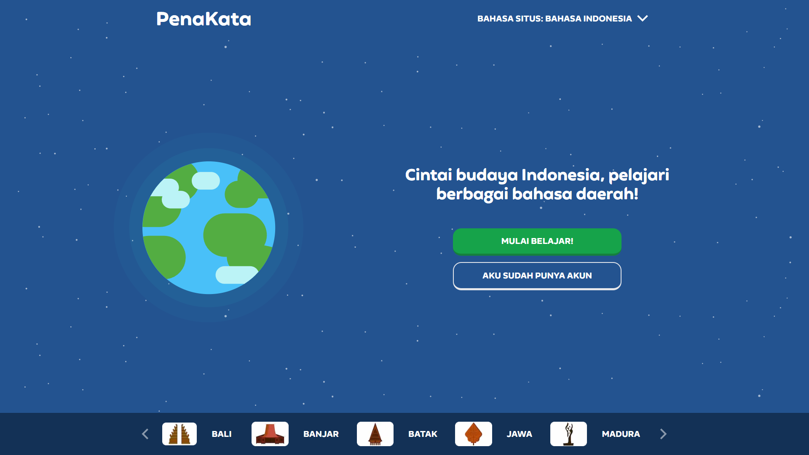
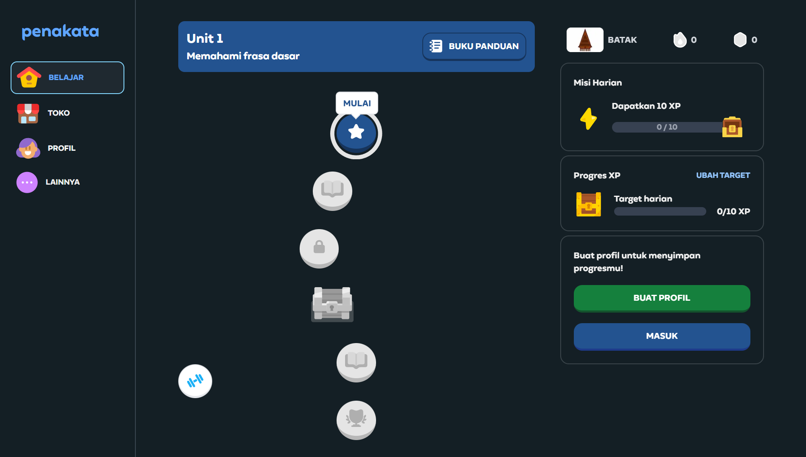
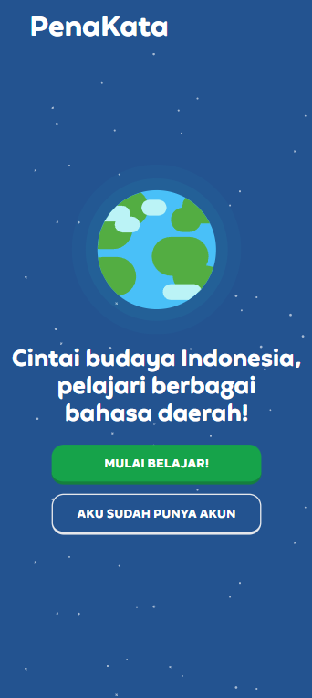
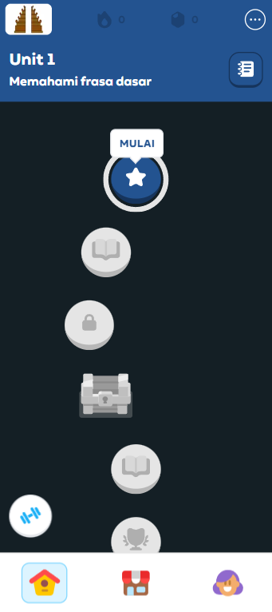

# PenaKata

### Description
A web-based application for learning regional languages of Indonesia, inspired by "Duolingo", built with TypeScript, React, Next.js, and Tailwind CSS.

Written with [React](https://react.dev/), [TypeScript](https://www.typescriptlang.org/), [Next.js](https://nextjs.org/), and [Tailwind](https://tailwindcss.com/)

### Documentations
Here are some screenshots of the finished product of this project.

  

  
  
  
  
  
  

